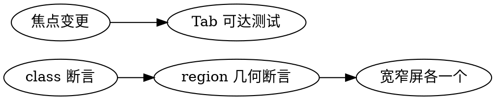

# TUI UX Guardrails

## Overview

防返工技能：TUI 布局/视觉/交互可达性变更的纪律约束。目标是减少"多次小修补"的迭代噪音，提升一次性正确率。

**Core principle:** 冻结设计意图 → 分层实现 → 几何断言验证。

## When to Use

**Trigger when user mentions:**
- 对齐、分组、上下/左右布局
- 宽窄屏、响应式设计
- tab 切换、focus、焦点链
- panel 拆分/合并、视觉不一致
- 提交历史显示同一视图被短时间内反复修改（如 memory/trace/watch/dashboard 连续补丁）

**When NOT to use:**
- 纯文案修改（无布局影响）
- 仅 TCSS 颜色微调（不影响几何）
- 后端逻辑变更（不影响 UI 组件）

## Quick Reference

| Step | Action | Verification |
|------|--------|--------------|
| 1 | 冻结设计意图 | 3-6 条可验证约束 |
| 2 | 拆分任务 | 先结构，后皮肤 |
| 3 | 最小实现 | 明确"保持不变"清单 |
| 4 | 几何测试 | 宽窄屏各至少 1 条 region 断言 |
| 5 | 验证运行 | ruff + layout tests |

## Execution Steps

### 1. 冻结设计意图（Design Contract）

**先写后改**。输出 3-6 条可验证约束：

```
- 几何：80 列下双行，140 列下单行
- 结构：Stats 与 Tree 必须是两个独立 panel
- 对齐：A 区块左对齐，B 区块右对齐
- 交互：可通过 Tab 到达
```

**禁止：** 未冻结意图前直接改 TCSS。

### 2. 拆分任务类型

| 层 | 内容 |
|---|---|
| **结构层** | `compose()` 树、容器关系、focus 链 |
| **皮肤层** | TCSS（边框、间距、颜色） |

**顺序固定：先结构，后皮肤。禁止在一个提交中交替改二者。**

### 3. 最小实现

- 只改目标视图和必要样式
- **禁止跨视图顺手重构**
- 明确列出"保持不变"的行为（例如 40/60 split）

### 4. 测试策略（必须）



- **class 断言 + region 几何断言**（x/y/width/height）
- 宽窄屏各至少一个尺寸：`80x24`、`140x24`
- 焦点行为变更必须测 `tab` 焦点链

### 5. 验证命令

```bash
uv run ruff check <changed files>
uv run pytest tests/tui/test_style_layout.py -k "<affected views>" -v
```

## Output Template

```
- 设计意图：
  - [3-6 条可验证约束]
- 代码改动：
  - [结构层变更 + 皮肤层变更]
- 测试证据：
  - [几何断言输出 + 焦点测试]
- 非目标范围（保持不变）：
  - [明确列出未改动行为]
```

## Definition of Done (DoD)

涉及 UI/UX 的任务在满足以下条件前**不得声明完成**：

- [ ] 设计意图 3-6 条全部可映射到代码和测试
- [ ] 至少 1 条宽屏几何断言 + 1 条窄屏几何断言
- [ ] panel 拆分任务：验证"独立 panel + 间距 + 对齐"三项
- [ ] 可交互区域：验证"可聚焦 + Tab 可达"
- [ ] 变更说明中明确"保持不变"的行为

## Common Rationalizations

| Excuse | Reality |
|--------|---------|
| "这只是个小调整" | 小调整累积成视觉不一致。先写设计意图。 |
| "我看截图确认过了" | 主观判断不可靠。几何断言才是可复现的验证。 |
| "顺便改一下旁边的" | 跨视图顺手重构 = 范围蔓延 = 返工根源。 |
| "测试太麻烦了" | 5 分钟写测试节省 30 分钟来回改。 |
| "先提交后面再补" | "后面"永远不会来。 |

## Red Flags - STOP and Start Over

- 直接改 TCSS 没写设计意图
- 一个提交同时改结构和皮肤
- 只测 class 没测 region 几何
- 开始"顺便"改其他视图
- 连续多个"fix ui small issue"提交

**All of these mean: Stop. Write design intent first. Then redo in separate commits.**

## Anti-Patterns

❌ 只改颜色不改结构，却试图解决结构问题
❌ 只看截图主观判断，不补几何断言
❌ 在主问题未闭环前顺手改其他视图
❌ 连续提交多个"fix ui small issue"而不归并

## Related Project Docs

See `AGENTS.md` → TUI UI/UX 变更守则 for full project-specific requirements.
