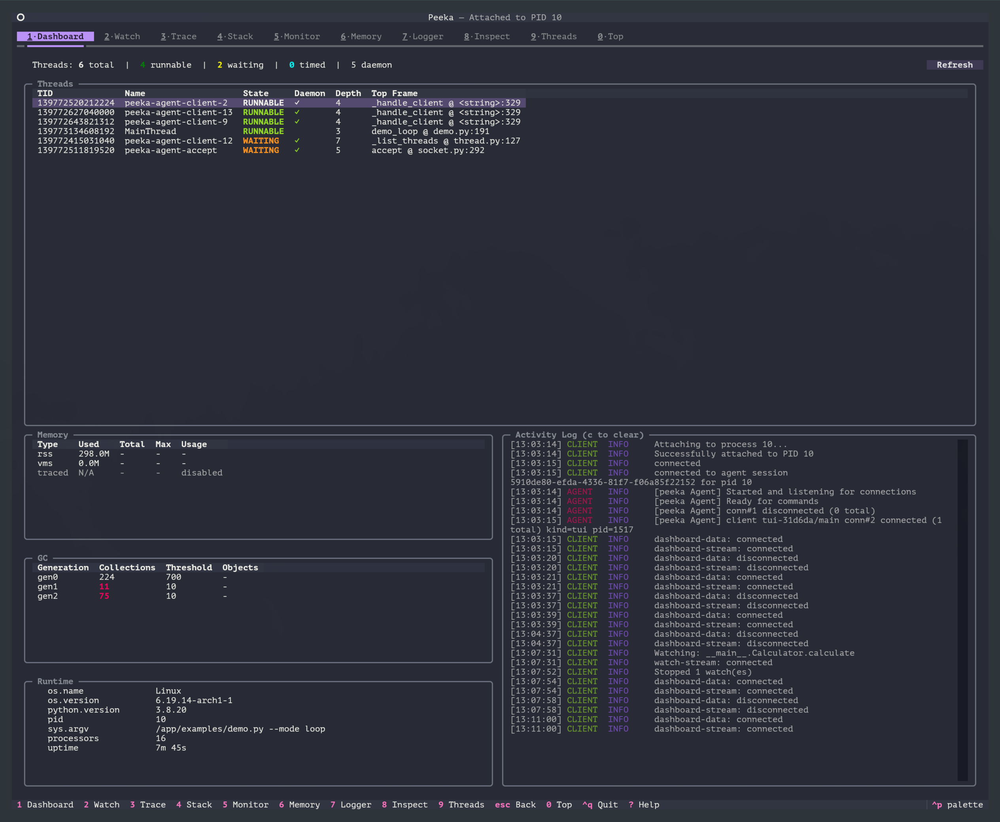
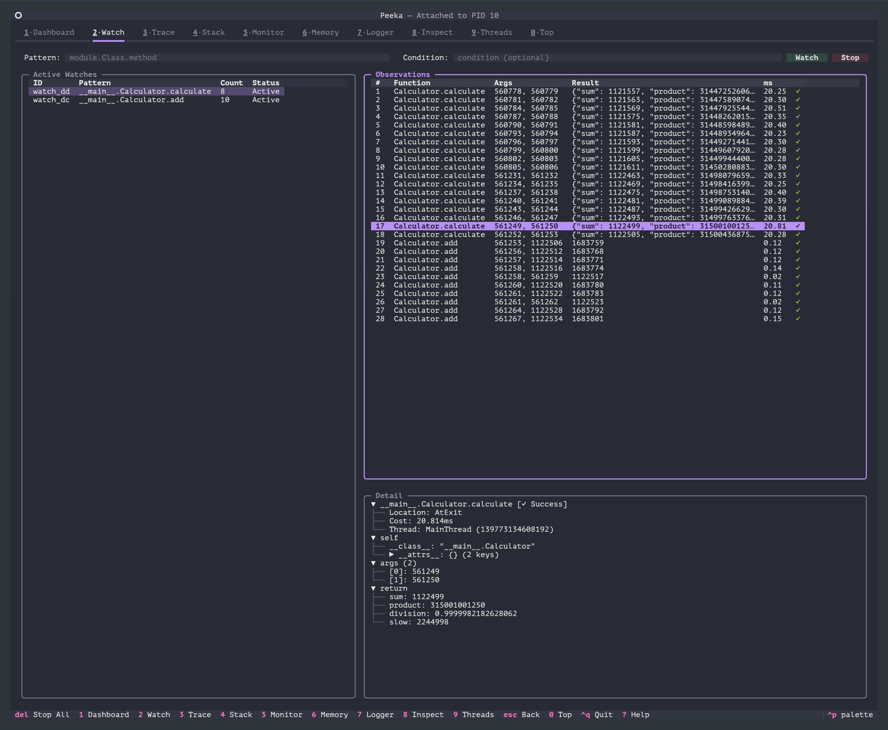
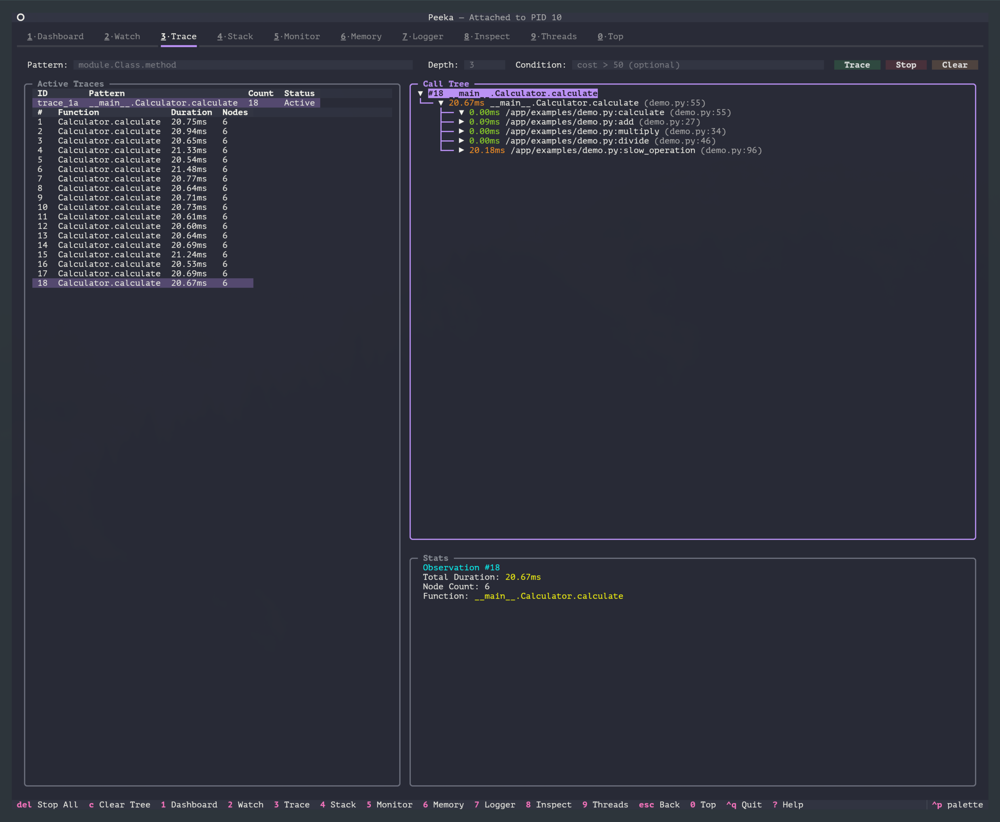

<p align="center">
  &nbsp;
  <strong style="font-size:2em;">Peeka</strong>
</p>

<p align="center">
  <a href="https://pypi.org/project/peeka/"></a>
  <a href="https://github.com/peeka-project/peeka/releases/latest"></a>
  <a href="https://github.com/peeka-project/peeka/actions"></a>
  <a href="https://github.com/peeka-project/peeka/blob/master/LICENSE"></a>
  <a href="https://peeka-project.github.io/"></a>
</p>

<p align="center">
  <a href="README.zh-CN.md">中文</a> | <strong>English</strong>
</p>

Runtime diagnostics for Python applications. Peeka attaches to a running Python process and lets you observe function calls, traces, stacks, logs, memory, threads, and hot paths without changing application code.

It uses [PEP 768](https://peps.python.org/pep-0768/) on Python 3.14+, with debugger-based fallback for Python 3.8.1-3.13.

## Screenshots

| Dashboard | Watch | Trace |
|-----------|-------|-------|
|  |  |  |

## Key Features

- **Non-invasive** - Inject observation logic at runtime and restore it on detach or reset.
- **Real-time streaming** - Stream observations over Unix domain sockets with low latency.
- **Production-minded** - Keep overhead bounded with fixed-size buffers and graceful recovery.
- **Safe filtering** - Evaluate conditions with `simpleeval` instead of Python `eval`.
- **Dual interface** - Use JSONL CLI for agents and automation, or TUI for human exploration.

## What Peeka Is For

- Inspect a live service when logs and metrics are not enough.
- Watch function inputs, return values, exceptions, and latency in real time.
- Trace call trees to find where time is spent inside one request or job.
- Capture call stacks, thread state, memory summaries, loggers, and runtime objects.

## Two Interfaces

Peeka is designed for two different operators:

| Interface | Designed for | Why it exists |
|-----------|--------------|---------------|
| CLI | Agents and automation | Stable commands with JSONL output for scripts, pipelines, and coding agents |
| TUI | Humans | An interactive terminal workspace for exploring live diagnostics without building shell pipelines |

## Install

```bash
# CLI only: best for agents, scripts, and headless environments.
pip install peeka

# CLI + TUI: best when a human will inspect the process interactively.
pip install "peeka[tui]"
```

Peeka supports Python 3.8.1+. The TUI requires Python 3.9+.

For Python 3.8.1-3.13, attaching needs debugger support: GDB on Linux or LLDB on macOS. On Linux, ptrace permissions must allow attaching to the target process.

## Python Support

| Python version | CLI | TUI | Attach mechanism | Main dependency |
|----------------|:---:|:---:|------------------|-----------------|
| 3.14+ | Yes | Yes | PEP 768 `sys.remote_exec()` | Same UID or `CAP_SYS_PTRACE` |
| 3.9-3.13 | Yes | Yes | GDB on Linux, LLDB on macOS | Debugger support and attach permission |
| 3.8.1-3.8.x | Yes | No | GDB on Linux, LLDB on macOS | Debugger support and attach permission |

See the [documentation](https://peeka-project.github.io/) for platform-specific setup and troubleshooting.

## Quick Start

### CLI for agents and automation

```bash
# Attach to a running Python process.
peeka-cli attach <pid>

# Observe function calls.
peeka-cli watch "module.Class.method" -n 5

# Trace a call tree.
peeka-cli trace "module.func" -d 3
```

The CLI emits structured JSONL, so agents and scripts can parse, filter, and persist observations reliably.

### TUI for humans

```bash
# Launch the TUI.
peeka
```

The TUI provides an interactive dashboard for browsing watches, traces, stacks, memory, threads, logs, and other runtime views.

Patterns use fully qualified function names such as `module.function` or `module.Class.method`.

## Core Commands

| Command | Purpose |
|---------|---------|
| `attach` / `detach` | Connect to or leave a target process |
| `watch` | Observe function arguments, return values, exceptions, and latency |
| `trace` | Trace nested calls and timing breakdowns |
| `stack` | Capture call stacks at function entry |
| `monitor` / `top` | Inspect periodic metrics and hot functions |
| `memory` / `thread` / `logger` | Inspect runtime memory, threads, and loggers |
| `inspect` / `sc` / `sm` | Inspect objects and search classes or methods |
| `reset` | Remove injected observations and restore wrapped functions |
| `run` | Start a script with Peeka injected from launch |

## Read More

- [Documentation](https://peeka-project.github.io/) - command reference, TUI usage, installation details, and troubleshooting.
- [Scenario guide](docs/scenarios.md) - practical debugging walkthroughs.
- [Demo guide](docs/demo-guide.md) - command-by-command examples against the demo app.
- [Attach internals](docs/python-process-attach-internals.md) - how Peeka injects diagnostics into a running Python interpreter.
- [Roadmap](ROADMAP.md) - planned work and product direction.

## License

Apache License 2.0

## Acknowledgments

- Inspired by [Alibaba Arthas](https://github.com/alibaba/arthas)
- Safe expression evaluation powered by [simpleeval](https://github.com/danthedeckie/simpleeval)
- Python 3.14+ attach path based on [PEP 768](https://peps.python.org/pep-0768/)
